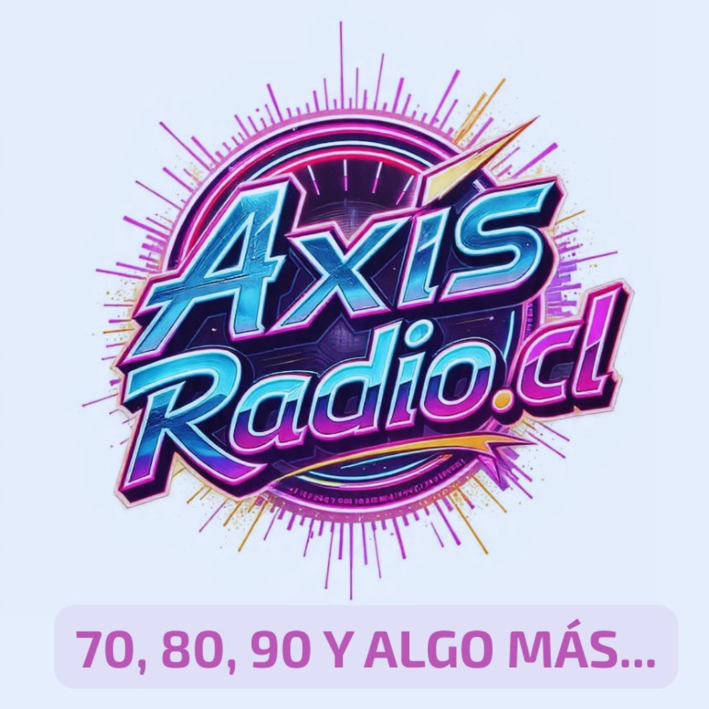

# OneSignal - Ejemplos de Uso

## 📚 Índice

1. [Implementación Básica](#implementación-básica)
2. [Botón Flotante](#botón-flotante)
3. [Botón en Header](#botón-en-header)
4. [Botón en Sidebar](#botón-en-sidebar)
5. [Modal de Bienvenida](#modal-de-bienvenida)
6. [Segmentación por Categorías](#segmentación-por-categorías)
7. [Notificaciones Personalizadas](#notificaciones-personalizadas)
8. [Analytics e Integración](#analytics-e-integración)

---

## Implementación Básica

### HTML Mínimo

```html
<!DOCTYPE html>
<html lang="es">
<head>
  <meta charset="UTF-8">
  <title>Mi Radio</title>
  <link rel="stylesheet" href="/assets/css/notification-button.css">
</head>
<body>
  
  <div id="notification-button-container"></div>
  
  <script type="module" src="/assets/js/onesignal-init.js"></script>
</body>
</html>
```

---

## Botón Flotante

### HTML

```html
<div id="notification-button-container" class="floating-notification"></div>
```

### CSS

```css
.floating-notification {
  position: fixed;
  bottom: 20px;
  right: 20px;
  z-index: 9999;
}

.floating-notification .notification-btn {
  width: 60px;
  height: 60px;
  border-radius: 50%;
  padding: 0;
  box-shadow: 0 4px 20px rgba(102, 126, 234, 0.4);
  display: flex;
  align-items: center;
  justify-content: center;
}

.floating-notification .notification-text {
  display: none;
}

.floating-notification .notification-btn:hover {
  transform: translateY(-4px) scale(1.1);
  box-shadow: 0 8px 30px rgba(102, 126, 234, 0.6);
}

/* Animación de entrada */
.floating-notification {
  animation: slideInRight 0.5s ease-out;
}

@keyframes slideInRight {
  from {
    transform: translateX(100px);
    opacity: 0;
  }
  to {
    transform: translateX(0);
    opacity: 1;
  }
}
```

---

## Botón en Header

### HTML

```html
<header class="site-header">
  <div class="logo">
    
  </div>
  
  <nav class="main-nav">
    <a href="#inicio">Inicio</a>
    <a href="#programas">Programas</a>
    <a href="#noticias">Noticias</a>
  </nav>
  
  <div class="header-actions">
    <div id="notification-button-container"></div>
    <button class="menu-toggle">☰</button>
  </div>
</header>
```

### CSS

```css
.site-header {
  display: flex;
  align-items: center;
  justify-content: space-between;
  padding: 15px 30px;
  background: white;
  box-shadow: 0 2px 10px rgba(0, 0, 0, 0.1);
}

.header-actions {
  display: flex;
  align-items: center;
  gap: 15px;
}

#notification-button-container .notification-btn {
  padding: 8px 16px;
  font-size: 13px;
}

@media (max-width: 768px) {
  #notification-button-container .notification-text {
    display: none;
  }
  
  #notification-button-container .notification-btn {
    width: 40px;
    height: 40px;
    padding: 0;
    border-radius: 50%;
  }
}
```

---

## Botón en Sidebar

### HTML

```html
<aside class="sidebar">
  <div class="sidebar-header">
    <h3>Menú</h3>
  </div>
  
  <nav class="sidebar-nav">
    <a href="#inicio">🏠 Inicio</a>
    <a href="#programas">📻 Programas</a>
    <a href="#noticias">📰 Noticias</a>
    <a href="#podcasts">🎙️ Podcasts</a>
  </nav>
  
  <div class="sidebar-footer">
    <div id="notification-button-container"></div>
  </div>
</aside>
```

### CSS

```css
.sidebar {
  width: 250px;
  height: 100vh;
  background: #1a1a2e;
  color: white;
  display: flex;
  flex-direction: column;
}

.sidebar-footer {
  margin-top: auto;
  padding: 20px;
}

#notification-button-container .notification-btn {
  width: 100%;
  justify-content: center;
}
```

---

## Modal de Bienvenida

### HTML

```html
<div id="welcome-modal" class="modal">
  <div class="modal-content">
    <h2>¡Bienvenido! 👋</h2>
    <p>Activa las notificaciones para recibir:</p>
    <ul>
      <li>✅ Noticias de última hora</li>
      <li>✅ Nuevos programas y episodios</li>
      <li>✅ Eventos especiales</li>
    </ul>
    <div id="notification-button-container"></div>
    <button class="btn-secondary" onclick="closeWelcomeModal()">
      Ahora no
    </button>
  </div>
</div>
```

### JavaScript

```javascript
import { oneSignalManager } from '/assets/js/onesignal-manager.js';
import { initNotificationButton } from '/assets/js/notification-button.js';

async function showWelcomeModal() {
  // Verificar si ya mostró el modal antes
  if (localStorage.getItem('welcome-modal-shown')) {
    return;
  }
  
  // Esperar a que OneSignal esté listo
  while (!oneSignalManager.initialized) {
    await new Promise(resolve => setTimeout(resolve, 100));
  }
  
  // Verificar si ya está suscrito
  const isSubscribed = await oneSignalManager.isSubscribed();
  if (isSubscribed) {
    return;
  }
  
  // Mostrar modal después de 3 segundos
  setTimeout(() => {
    document.getElementById('welcome-modal').classList.add('show');
    initNotificationButton('notification-button-container');
  }, 3000);
}

function closeWelcomeModal() {
  document.getElementById('welcome-modal').classList.remove('show');
  localStorage.setItem('welcome-modal-shown', 'true');
}

// Escuchar cuando el usuario se suscriba
window.addEventListener('onesignal-subscription-changed', (event) => {
  if (event.detail.isSubscribed) {
    closeWelcomeModal();
  }
});

// Iniciar
showWelcomeModal();
```

### CSS

```css
.modal {
  display: none;
  position: fixed;
  top: 0;
  left: 0;
  width: 100%;
  height: 100%;
  background: rgba(0, 0, 0, 0.7);
  z-index: 10000;
  align-items: center;
  justify-content: center;
}

.modal.show {
  display: flex;
}

.modal-content {
  background: white;
  padding: 40px;
  border-radius: 20px;
  max-width: 500px;
  text-align: center;
  animation: modalSlideIn 0.3s ease-out;
}

@keyframes modalSlideIn {
  from {
    transform: translateY(-50px);
    opacity: 0;
  }
  to {
    transform: translateY(0);
    opacity: 1;
  }
}

.modal-content h2 {
  margin-bottom: 20px;
  color: #333;
}

.modal-content ul {
  text-align: left;
  margin: 20px 0;
  list-style: none;
}

.modal-content li {
  padding: 8px 0;
  color: #666;
}

.btn-secondary {
  margin-top: 15px;
  padding: 10px 20px;
  background: #e0e0e0;
  border: none;
  border-radius: 8px;
  cursor: pointer;
}
```

---

## Segmentación por Categorías

### HTML

```html
<div class="notification-preferences">
  <h3>Preferencias de Notificaciones</h3>
  
  <label>
    <input type="checkbox" id="pref-news" checked>
    📰 Noticias
  </label>
  
  <label>
    <input type="checkbox" id="pref-events" checked>
    🎉 Eventos
  </label>
  
  <label>
    <input type="checkbox" id="pref-podcasts" checked>
    🎙️ Podcasts
  </label>
  
  <label>
    <input type="checkbox" id="pref-promotions">
    🎁 Promociones
  </label>
  
  <button onclick="savePreferences()">Guardar Preferencias</button>
</div>
```

### JavaScript

```javascript
import { oneSignalManager } from '/assets/js/onesignal-manager.js';

async function savePreferences() {
  const preferences = {
    'notif_news': document.getElementById('pref-news').checked ? 'true' : 'false',
    'notif_events': document.getElementById('pref-events').checked ? 'true' : 'false',
    'notif_podcasts': document.getElementById('pref-podcasts').checked ? 'true' : 'false',
    'notif_promotions': document.getElementById('pref-promotions').checked ? 'true' : 'false',
  };
  
  const success = await oneSignalManager.sendTags(preferences);
  
  if (success) {
    alert('✅ Preferencias guardadas correctamente');
  } else {
    alert('❌ Error al guardar preferencias');
  }
}

// Cargar preferencias al iniciar
async function loadPreferences() {
  // Esperar a que OneSignal esté listo
  while (!oneSignalManager.initialized) {
    await new Promise(resolve => setTimeout(resolve, 100));
  }
  
  // Verificar si está suscrito
  const isSubscribed = await oneSignalManager.isSubscribed();
  if (!isSubscribed) {
    return;
  }
  
  // Obtener tags del usuario
  window.OneSignal.push(() => {
    window.OneSignal.getTags((tags) => {
      if (tags.notif_news === 'false') {
        document.getElementById('pref-news').checked = false;
      }
      if (tags.notif_events === 'false') {
        document.getElementById('pref-events').checked = false;
      }
      if (tags.notif_podcasts === 'false') {
        document.getElementById('pref-podcasts').checked = false;
      }
      if (tags.notif_promotions === 'true') {
        document.getElementById('pref-promotions').checked = true;
      }
    });
  });
}

loadPreferences();
```

---

## Notificaciones Personalizadas

### Enviar Tags Automáticamente

```javascript
import { oneSignalManager } from '/assets/js/onesignal-manager.js';

// Cuando el usuario se suscribe
window.addEventListener('onesignal-subscription-changed', async (event) => {
  if (event.detail.isSubscribed) {
    // Enviar información del usuario
    await oneSignalManager.sendTags({
      'idioma': 'es',
      'pais': 'Chile',
      'ciudad': 'Santiago',
      'fecha_suscripcion': new Date().toISOString(),
      'template': 'minimalista',
      'version': '1.0.0'
    });
  }
});
```

### Tracking de Comportamiento

```javascript
// Trackear qué secciones visita el usuario
function trackSection(section) {
  oneSignalManager.sendTags({
    [`visito_${section}`]: 'true',
    [`ultima_visita_${section}`]: new Date().toISOString()
  });
}

// Uso
document.getElementById('btn-noticias').addEventListener('click', () => {
  trackSection('noticias');
});

document.getElementById('btn-podcasts').addEventListener('click', () => {
  trackSection('podcasts');
});
```

---

## Analytics e Integración

### Google Analytics

```javascript
import { oneSignalManager } from '/assets/js/onesignal-manager.js';

// Trackear suscripciones
window.addEventListener('onesignal-subscription-changed', (event) => {
  if (event.detail.isSubscribed) {
    gtag('event', 'subscribe', {
      'event_category': 'push_notifications',
      'event_label': 'user_subscribed'
    });
  }
});

// Trackear clics en notificaciones
window.OneSignal.push(() => {
  window.OneSignal.on('notificationClick', (event) => {
    gtag('event', 'notification_click', {
      'event_category': 'push_notifications',
      'event_label': event.data.title
    });
  });
});
```

### Facebook Pixel

```javascript
// Trackear suscripciones
window.addEventListener('onesignal-subscription-changed', (event) => {
  if (event.detail.isSubscribed) {
    fbq('track', 'Subscribe', {
      content_name: 'Push Notifications'
    });
  }
});
```

### Custom Backend

```javascript
import { oneSignalManager } from '/assets/js/onesignal-manager.js';

// Guardar User ID en tu backend
window.addEventListener('onesignal-subscription-changed', async (event) => {
  if (event.detail.isSubscribed) {
    const userId = await oneSignalManager.getUserId();
    
    // Enviar a tu backend
    await fetch('/api/save-push-subscription', {
      method: 'POST',
      headers: { 'Content-Type': 'application/json' },
      body: JSON.stringify({
        oneSignalUserId: userId,
        timestamp: new Date().toISOString()
      })
    });
  }
});
```

---

## Botón con Contador de Notificaciones

### HTML

```html
<div id="notification-button-container" class="notification-with-badge"></div>
```

### JavaScript

```javascript
import { oneSignalManager } from '/assets/js/onesignal-manager.js';
import { initNotificationButton } from '/assets/js/notification-button.js';

// Inicializar botón
initNotificationButton('notification-button-container');

// Agregar badge con contador
let notificationCount = 0;

window.OneSignal.push(() => {
  window.OneSignal.on('notificationDisplay', () => {
    notificationCount++;
    updateBadge();
  });
});

function updateBadge() {
  const container = document.getElementById('notification-button-container');
  let badge = container.querySelector('.notification-badge-count');
  
  if (!badge) {
    badge = document.createElement('span');
    badge.className = 'notification-badge-count';
    container.appendChild(badge);
  }
  
  badge.textContent = notificationCount;
  badge.style.display = notificationCount > 0 ? 'flex' : 'none';
}

// Limpiar contador al hacer clic
document.addEventListener('click', (e) => {
  if (e.target.closest('#notification-button-container')) {
    notificationCount = 0;
    updateBadge();
  }
});
```

### CSS

```css
.notification-with-badge {
  position: relative;
}

.notification-badge-count {
  position: absolute;
  top: -8px;
  right: -8px;
  background: #ef4444;
  color: white;
  border-radius: 50%;
  width: 24px;
  height: 24px;
  display: flex;
  align-items: center;
  justify-content: center;
  font-size: 12px;
  font-weight: bold;
  box-shadow: 0 2px 8px rgba(239, 68, 68, 0.4);
  animation: pulse 2s infinite;
}

@keyframes pulse {
  0%, 100% {
    transform: scale(1);
  }
  50% {
    transform: scale(1.1);
  }
}
```

---

## Botón con Tooltip

### HTML

```html
<div id="notification-button-container" class="notification-with-tooltip"></div>
```

### CSS

```css
.notification-with-tooltip {
  position: relative;
}

.notification-with-tooltip::after {
  content: 'Recibe notificaciones de noticias y eventos';
  position: absolute;
  bottom: calc(100% + 10px);
  left: 50%;
  transform: translateX(-50%);
  background: #333;
  color: white;
  padding: 8px 12px;
  border-radius: 6px;
  font-size: 12px;
  white-space: nowrap;
  opacity: 0;
  pointer-events: none;
  transition: opacity 0.3s ease;
}

.notification-with-tooltip::before {
  content: '';
  position: absolute;
  bottom: calc(100% + 2px);
  left: 50%;
  transform: translateX(-50%);
  border: 8px solid transparent;
  border-top-color: #333;
  opacity: 0;
  pointer-events: none;
  transition: opacity 0.3s ease;
}

.notification-with-tooltip:hover::after,
.notification-with-tooltip:hover::before {
  opacity: 1;
}
```

---

## Conclusión

Estos ejemplos cubren los casos de uso más comunes. Puedes combinarlos y personalizarlos según tus necesidades.

Para más información, consulta:
- `ONESIGNAL_INTEGRATION.md` - Documentación completa
- `ONESIGNAL_QUICK_START.md` - Guía rápida
- `ONESIGNAL_DEVELOPER_GUIDE.md` - Guía para desarrolladores
